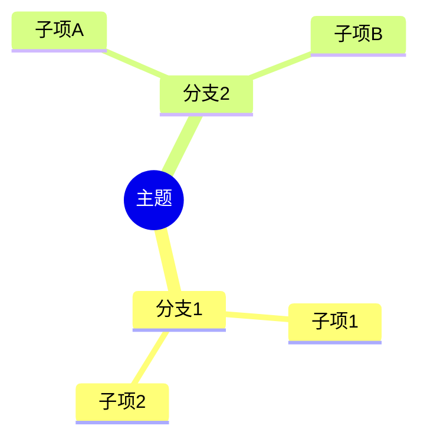
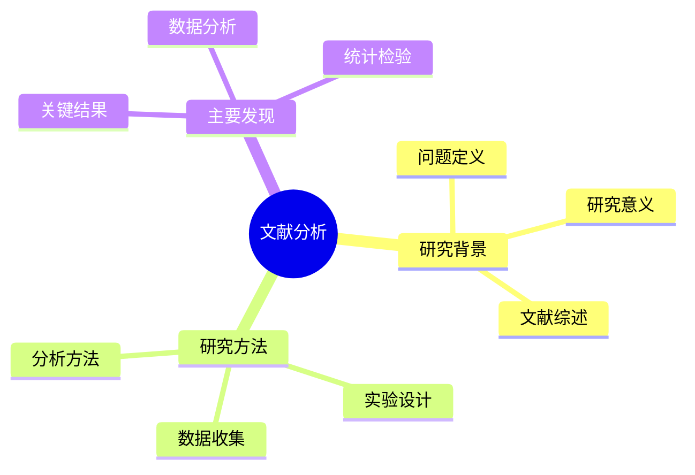

# 思维导图可视化功能详解

## 🧠 新增功能概述

我们在Gradio界面中新增了**实时思维导图可视化功能**，让用户可以直接在Web界面中查看美观的思维导图，而不仅仅是Mermaid代码。

## ✨ 功能特色

### 🎨 实时渲染
- **即时可视化**: 处理完成后立即显示可视化思维导图
- **基于Mermaid.js**: 使用最新的Mermaid.js库进行渲染
- **专业配色**: 定制的配色方案，适合学术和专业用途

### 📊 交互式体验
- **缩放功能**: 支持图表的缩放查看
- **滚动导航**: 大型思维导图支持滚动浏览
- **响应式设计**: 自适应不同屏幕尺寸

### 🔄 双重展示
- **左侧**: Mermaid代码文本，便于复制和编辑
- **右侧**: 实时可视化图表，直观展示结构关系

## 🎯 界面布局

### 单文件处理 - 思维导图标签页
```
┌─────────────────┬─────────────────┐
│ Mermaid代码     │ 实时可视化      │
│ ┌─────────────┐ │ ┌─────────────┐ │
│ │ mindmap     │ │ │    ┌──────┐ │ │
│ │   root(...) │ │ │    │中心  │ │ │
│ │     分支1   │ │ │ ┌──┴──────┘ │ │
│ │     分支2   │ │ │ │    分支1  │ │
│ │     ...     │ │ │ │    分支2  │ │
│ └─────────────┘ │ │ └───────────┘ │ │
└─────────────────┴─────────────────┘
```

### 思维导图可视化特点
- **中心节点**: 突出显示主题
- **分层结构**: 清晰的层次关系
- **颜色区分**: 不同层级使用不同颜色
- **连接线**: 流畅的连接线设计

## 🔧 技术实现

### Mermaid.js集成
```html
<script src="https://cdn.jsdelivr.net/npm/mermaid@10.6.1/dist/mermaid.min.js"></script>
```

### 自定义主题配置
```javascript
mermaid.initialize({
    startOnLoad: true,
    theme: 'default',
    themeVariables: {
        primaryColor: '#f9f9f9',
        primaryTextColor: '#333',
        primaryBorderColor: '#ddd',
        lineColor: '#666',
        secondaryColor: '#f0f0f0',
        tertiaryColor: '#fff'
    }
});
```

### HTML容器设计
- **固定高度**: 500px的展示区域
- **滚动支持**: 超出区域自动滚动
- **边框样式**: 圆角边框，专业外观
- **居中对齐**: 内容自动居中显示

## 🎮 使用方法

### 1. 处理文献生成思维导图
1. 在"单文件处理"标签页上传PDF
2. 输入提取需求
3. 点击"开始处理"
4. 处理完成后切换到"思维导图"标签页
5. 查看左侧的Mermaid代码和右侧的可视化图表

### 2. 演示功能体验
1. 切换到"帮助与设置"标签页
2. 找到"思维导图演示"部分
3. 点击"生成演示思维导图"按钮
4. 观察演示思维导图的可视化效果

### 3. 代码复制和分享
- 从左侧文本框复制Mermaid代码
- 可在其他支持Mermaid的平台使用
- 右侧可视化图表支持截图保存

## 🎨 可视化样式

### 颜色方案
- **背景色**: 浅灰色 (#f9f9f9)
- **文本色**: 深灰色 (#333)
- **边框色**: 中灰色 (#ddd)
- **连接线**: 深灰色 (#666)

### 布局特点
- **响应式**: 自适应容器大小
- **居中对齐**: 内容自动居中
- **清晰边界**: 明确的容器边框
- **专业外观**: 适合学术和商业用途

## 📊 支持的思维导图类型

### 标准思维导图


### 复杂层次结构


## 🔍 故障排除

### 常见问题

**Q: 思维导图不显示**
- 检查网络连接（需要加载Mermaid.js）
- 确认Mermaid代码格式正确
- 刷新页面重试

**Q: 可视化图表显示不全**
- 使用滚动条查看完整内容
- 调整浏览器窗口大小
- 检查Mermaid代码是否过于复杂

**Q: 样式显示异常**
- 清除浏览器缓存
- 确认使用现代浏览器
- 检查是否有广告拦截器干扰

### 浏览器兼容性
- ✅ Chrome 90+
- ✅ Firefox 88+
- ✅ Safari 14+
- ✅ Edge 90+

## 🚀 未来增强

### 计划功能
- **导出PNG**: 直接导出思维导图为图片
- **交互编辑**: 在线编辑思维导图
- **多种主题**: 更多可视化主题选择
- **自定义样式**: 用户自定义颜色和样式

### 性能优化
- **缓存机制**: 重复访问时快速加载
- **懒加载**: 按需加载可视化组件
- **压缩优化**: 减少加载时间

## 📞 技术支持

如果遇到思维导图可视化相关问题：
1. 查看浏览器控制台错误信息
2. 确认网络连接正常
3. 尝试在"帮助与设置"中的演示功能
4. 检查Mermaid代码语法是否正确

---

这个新功能大大提升了思维导图的可用性和视觉效果，为用户提供了更直观的文献分析结果展示！🎉