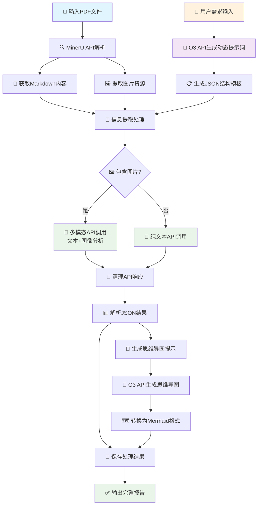

# 文献处理Agent - 全流程PDF文献分析工具

一个完整的文献处理系统，即将集成**自动下载、解析、提取、分析**的全流程功能。正在开发PypaperBot文献自动下载，结合现有的PDF解析、智能信息提取和思维导图生成，打造从文献检索到知识可视化的一站式解决方案。

## 🔄 核心处理流程



## 🚀 核心功能

### 📥 自动文献下载 (开发中)
- 集成PypaperBot实现智能文献检索下载
- 支持多个学术数据库批量下载
- 关键词搜索和精准筛选
- 与后续处理流程无缝集成

### 📄 智能PDF解析
- 使用MinerU API高质量解析PDF文档
- 支持OCR识别和图表提取
- 输出结构化Markdown格式

### 🧠 动态信息提取
- 根据用户需求自动生成提示词
- 使用O3大模型进行智能信息提取
- 支持文本和图像的综合分析
- 输出结构化JSON数据

### 🗺️ 思维导图生成
- 基于提取信息自动生成思维导图
- 支持Mermaid格式输出
- 可视化文献核心内容和关系

### 📊 批量处理支持
- 单文件精确处理
- 批量文件高效处理
- 进度监控和错误处理

## 🖥️ 使用界面

### 现代化Web界面 (推荐)
```bash
python run_agent.py gui
# 或专用启动
python run_gradio.py
```
- 🎨 **现代化设计** - 基于Gradio的专业Web界面
- 📁 **拖拽上传** - 支持多文件拖拽上传
- 🔄 **实时进度** - 动态进度条和状态更新
- 📊 **结果可视化** - 交互式结果展示和预览
- 🧠 **思维导图** - 实时Mermaid思维导图可视化渲染
- 📱 **响应式** - 支持桌面和移动端访问
- 🔗 **分享功能** - 可生成公共访问链接

### 命令行界面
```bash
python run_agent.py cli
```
- ⚡ 快速批量处理
- 🔧 脚本化自动处理
- 📝 详细日志输出

### 演示模式
```bash
python run_agent.py demo
```
- 🎯 快速体验功能
- 📖 预设提取需求
- 🔍 结果展示和说明

## 📦 安装和配置

### 1. 环境要求
- **Python 3.7+** (推荐 3.8+)
- **操作系统**: Windows, macOS, Linux

### 2. 依赖安装

#### 方法一：一键安装 (推荐)
```bash
pip install -r requirements.txt
```

#### 方法二：手动安装核心依赖
```bash
# 必须的核心依赖
pip install requests>=2.25.1 openai>=1.0.0 tqdm>=4.62.0 python-dotenv>=0.19.0

# Web界面 (推荐)
pip install gradio>=4.0.0
```

#### 依赖说明
- **requests**: HTTP请求库，用于API调用
- **openai**: OpenAI API客户端，兼容O3.fan平台
- **tqdm**: 进度条显示
- **python-dotenv**: 环境变量管理  
- **gradio**: 现代Web界面框架 (推荐安装)

> 📝 **注意**: tkinter、json、pathlib等为Python标准库，通常无需额外安装

### 3. API配置

⚠️ **重要说明**: 本项目使用的是 **O3.fan平台的Claude Sonnet 4模型**，不是OpenAI的O3模型。

#### 方法一：交互式配置 (推荐)
```bash
python config.py setup
```

#### 方法二：手动配置
1. 复制配置模板：
```bash
cp config.json.template config.json
```

2. 编辑 `config.json` 填入您的API密钥：
```json
{
  "o3_api_key": "您的O3_API密钥",
  "o3_base_url": "https://api.o3.fan/v1",
  "o3_model": "claude-sonnet-4-20250514",
  "mineru_api_key": "您的MinerU_API密钥",
  "mineru_base_url": "https://api.mineru.com"
}
```

#### 方法三：环境变量
```bash
export O3_API_KEY="您的O3_API密钥"
export MINERU_API_KEY="您的MinerU_API密钥"
```

#### 获取API密钥
- **O3 API**: 访问 [https://api.o3.fan](https://api.o3.fan) 注册获取
- **MinerU API**: 访问 [https://api.mineru.com](https://api.mineru.com) 注册获取

#### 配置验证
```bash
python config.py status
```

### 4. 完整安装步骤

#### 步骤 1: 克隆项目
```bash
git clone https://github.com/chengali888/literature_analyzer.git
cd literature_analyzer
```

#### 步骤 2: 安装依赖
```bash
pip install -r requirements.txt
```

#### 步骤 3: 配置API密钥
```bash
python config.py setup
```
按提示输入您的O3和MinerU API密钥

#### 步骤 4: 启动应用
```bash
# 现代化Web界面 (推荐)
python run_gradio.py

# 或使用通用启动器
python run_agent.py gui

# 命令行界面
python run_agent.py cli

# 演示模式
python run_agent.py demo
```

### 5. 故障排除

#### 常见问题解决
1. **导入错误**: 确保已安装所有依赖
   ```bash
   pip install -r requirements.txt
   ```

2. **API密钥错误**: 检查配置
   ```bash
   python config.py status
   ```

3. **tkinter错误** (Linux用户):
   ```bash
   # Ubuntu/Debian
   sudo apt-get install python3-tk
   
   # CentOS/RHEL
   sudo yum install tkinter
   ```

## 🔧 详细使用方法

### 单文件处理
```bash
python literature_processing_agent.py single \
  --pdf "论文.pdf" \
  --requirements "提取材料性质、合成方法和应用信息"
```

### 批量处理
```bash
python literature_processing_agent.py batch \
  --dir "PDF文件夹" \
  --requirements "提取实验数据和性能参数"
```

### Web界面模式 (推荐)
1. 启动Web界面: `python run_gradio.py` 或 `python run_agent.py gui`
2. 在浏览器中访问显示的地址（通常是 http://localhost:7860）
3. 拖拽上传PDF文件或点击选择
4. 选择预设需求模板或输入自定义需求
5. 选择"单文件处理"或"批量处理"标签页
6. 点击"开始处理"按钮
7. 实时查看处理进度和日志
8. 在结果标签页查看提取信息、思维导图和报告
9. 下载或分享处理结果

## 📋 输出结果

### 文件结构
```
processed_results/
├── extracted_information.json    # 结构化提取信息
├── mindmap.json                  # 思维导图数据
├── mindmap.mmd                   # Mermaid格式思维导图
├── processing_report.md          # 处理报告
└── original_parse_results/       # 原始解析结果
    ├── full.md                   # 完整Markdown文档
    ├── images/                   # 提取的图片
    └── layout.json               # 文档布局信息
```

### 数据格式
提取的信息采用标准化JSON格式，包含：
- 📊 基本元数据（标题、作者、摘要等）
- 🔬 实验信息（方法、条件、结果等）
- 📈 性能数据（数值、单位、条件等）
- 🧪 材料信息（结构、性质、应用等）
- 🗺️ 思维导图数据

## 🎯 应用场景

### 📚 学术研究
- 文献综述和信息整理
- 实验数据提取和对比
- 研究趋势分析

### 🔬 科研开发
- 材料性质数据库构建
- 实验方法标准化
- 技术调研和分析

### 📊 知识管理
- 文档自动化处理
- 知识图谱构建
- 信息可视化展示

## 🔨 高级功能

### 自定义提取模板
系统支持根据用户需求动态生成提取提示词：
- 🎯 精确定制提取字段
- 📋 自动验证数据完整性
- 🔄 迭代优化提取效果

### 图像分析增强
结合PDF中的图表进行综合分析：
- 📊 图表数据自动识别
- 🧬 分子结构图解析
- 📈 实验结果图表分析

### 批量质量控制
- ✅ 自动错误检测和重试
- 📊 处理进度和统计报告
- 🔍 结果质量评估

## ⚙️ 技术架构

### 🔧 大模型API调用机制

系统采用**三阶段**API调用策略，实现智能化信息提取：

#### 阶段一：动态提示词生成
```python
# 1. 根据用户需求生成专用提示词
user_requirements → O3 API → {
    "extraction_prompt": "定制提取指令",
    "target_json_structure": {...},
    "validation_criteria": [...],
    "special_instructions": [...]
}
```

#### 阶段二：信息提取执行
```python
# 2a. 纯文本模式
text_content + dynamic_prompt → O3 API → structured_json

# 2b. 多模态模式 (含图片)
text_content + images + dynamic_prompt → O3 Vision API → structured_json
```

#### 阶段三：思维导图生成
```python
# 3. 基于提取结果生成可视化
extracted_info → O3 API → mindmap_json → Mermaid_code
```

### 🛡️ 错误处理与重试
- **智能重试**: 失败时自动重试3次，指数退避
- **响应清理**: 自动清理API响应中的markdown标记
- **JSON验证**: 多层解析确保数据完整性

### 📊 配置说明

#### API限制
- **MinerU**: 单文件≤200MB，每日2000页免费额度
- **O3**: 按API调用计费，建议合理控制请求频率

#### 性能优化
- 图片数量限制（单次≤5张，避免token超限）
- 批量处理间隔控制（防止API限流）
- 智能内容截断（超长文档自动分段）

## 🐛 常见问题

### Q: 处理失败怎么办？
A: 检查网络连接、API密钥配置和文件格式。查看详细日志定位问题。

### Q: 如何提高提取准确性？
A: 使用更具体的需求描述，选择合适的处理模式，充分利用图像分析功能。

### Q: 支持哪些文件格式？
A: 主要支持PDF，MinerU还支持DOC、DOCX、PPT、PPTX等格式。

### Q: 如何自定义提取字段？
A: 在需求描述中详细说明要提取的信息类型和格式要求。

## 🚧 开发中功能

### 📥 自动文献下载 (开发中)
正在集成 **PypaperBot** 实现全自动文献下载功能：

- 🔍 **智能检索**: 根据关键词自动搜索相关文献
- 📄 **批量下载**: 支持从多个学术数据库下载PDF
- 🎯 **精准筛选**: 基于引用数、发表年份等条件过滤
- 🔄 **无缝集成**: 下载后直接进入解析和提取流程
- 📊 **进度跟踪**: 实时显示下载进度和成功率

#### 支持的数据库
- 🌐 **Google Scholar** - 谷歌学术
- 📚 **IEEE Xplore** - IEEE数据库  
- 🔬 **PubMed** - 生物医学文献
- 📖 **arXiv** - 预印本文献
- 🏛️ **ResearchGate** - 学术社交平台

#### 使用方式 (计划中)
```bash
# 关键词搜索并下载
python run_agent.py download --keywords "machine learning materials" --count 10

# Web界面一键下载
# 在Gradio界面中输入搜索关键词，自动下载并处理
```

> 💡 **提示**: 此功能将极大简化文献收集工作流程，从搜索到分析一气呵成！

## 📝 更新日志

### v1.1.0 (开发中)
- 🚧 **新增**: PypaperBot文献自动下载功能
- 🚧 **新增**: 关键词智能检索
- 🚧 **新增**: 多数据库支持
- 🚧 **优化**: 下载进度可视化

### v1.0.0 (2025-01)
- ✅ 基础PDF解析功能
- ✅ 动态提示词生成
- ✅ 信息提取和思维导图
- ✅ 图形用户界面
- ✅ 批量处理支持

## 👥 贡献指南

欢迎提交Issue和Pull Request来改进这个项目！

### 如何贡献
1. Fork 这个仓库
2. 创建您的特性分支 (`git checkout -b feature/AmazingFeature`)
3. 提交您的更改 (`git commit -m 'Add some AmazingFeature'`)
4. 推送到分支 (`git push origin feature/AmazingFeature`)
5. 开启一个 Pull Request

## 📄 许可证

本项目采用 [MIT License](LICENSE) 开源许可证。

## 📞 联系方式

- **作者**: chengali888
- **项目地址**: [https://github.com/chengali888/literature_analyzer](https://github.com/chengali888/literature_analyzer)
- **问题反馈**: [Issues](https://github.com/chengali888/literature_analyzer/issues)

---

**⭐ 如果这个项目对您有帮助，请给个 Star！**